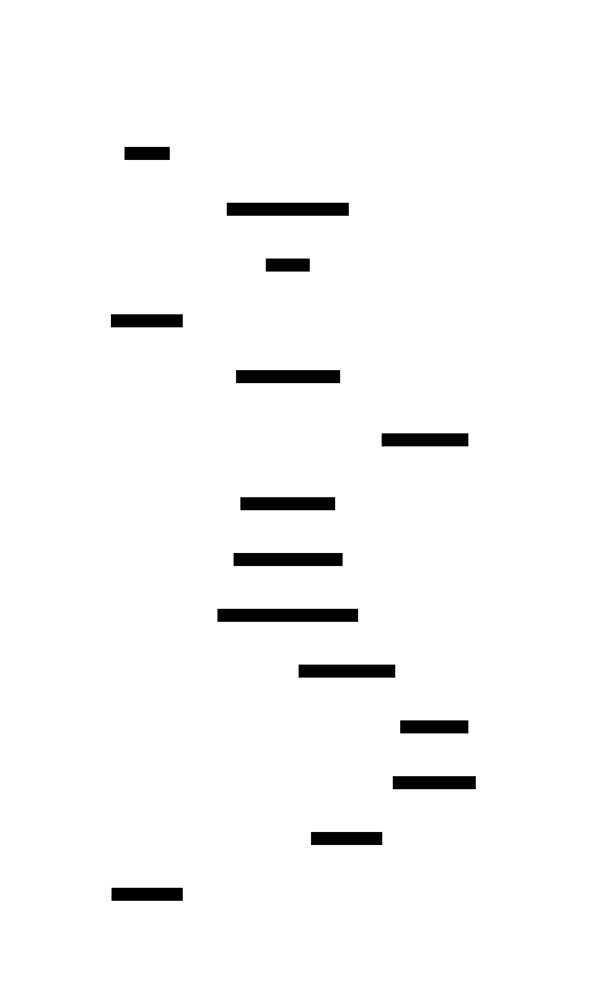
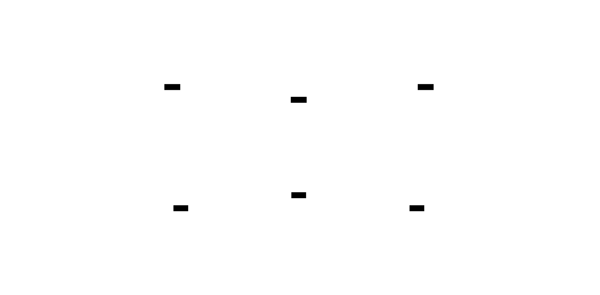

# claude-toolshed <!-- omit in toc -->

A plugin marketplace for Claude Code — install pre-packaged skills directly into your Claude environment.

> **Trust warning:** Plugins can execute arbitrary commands on your machine. Review a plugin's code before installing it.

## Contents <!-- omit in toc -->

- [Install](#install)
- [Plugins](#plugins)
  - [mermaid](#mermaid)
  - [d2](#d2)
  - [merge-checks](#merge-checks)
  - [dev-setup](#dev-setup)
  - [trim-md](#trim-md)
  - [plugin-updater](#plugin-updater)

## Install

Add the marketplace, then install any plugin:

```
/plugin marketplace add diegomarino/claude-toolshed

/plugin install mermaid@claude-toolshed
/plugin install d2@claude-toolshed
/plugin install merge-checks@claude-toolshed
/plugin install dev-setup@claude-toolshed
/plugin install trim-md@claude-toolshed
/plugin install plugin-updater@claude-toolshed

```

## Plugins

| Plugin | Description |
| --- | --- |
| [mermaid](#mermaid) | Generate, validate, render Mermaid diagrams from text or code (powered by [beautiful-mermaid](https://github.com/lukilabs/beautiful-mermaid)) |
| [d2](#d2) | Generate, validate, render D2 diagrams from text or code — no Node.js required |
| [merge-checks](#merge-checks) | Audit code changes across 13 quality dimensions |
| [dev-setup](#dev-setup) | Generate dev server lifecycle scripts with pool-based port isolation (20000-29999) |
| [trim-md](#trim-md) | Trim and optimize markdown files for LLM agent consumption |
| [plugin-updater](#plugin-updater) | Auto-update third-party marketplace plugins on session start |

---

### mermaid

Generate, validate, render, and manage Mermaid diagrams from natural language or existing codebases. Powered by [beautiful-mermaid](https://github.com/lukilabs/beautiful-mermaid) for themed rendering.

<p>
  
  
</p>
<p align="center"><em>Default Mermaid → beautiful-mermaid (Dracula theme)</em></p>

| Command | What it does |
| --- | --- |
| `/mermaid-diagram` | Describe what you want — auto-detects the right diagram type |
| `/mermaid-architect` | Point at a codebase — generates a suite of relevant diagrams |
| `/mermaid-validate` | Check Mermaid syntax in `.md` files or directories |
| `/mermaid-render` | Render `.mmd` files to SVG |
| `/mermaid-config` | Set theme, output format, and check dependencies |

```text
/mermaid-diagram "user login with JWT and refresh token"
/mermaid-architect src/
```

> **[Full documentation →](plugins/mermaid/README.md)** — diagram types, code-to-diagram routing, configuration, troubleshooting

**7 diagram types:**

<details>
<summary>Sequence</summary>
<br>
<p align="center"></p>
</details>

<details>
<summary>Architecture</summary>
<br>
<p align="center"></p>
</details>

<details>
<summary>Entity-Relationship</summary>
<br>
<p align="center"></p>
</details>

<details>
<summary>Activity</summary>
<br>
<p align="center"></p>
</details>

<details>
<summary>State</summary>
<br>
<p align="center"></p>
</details>

<details>
<summary>Class</summary>
<br>
<p align="center"></p>
</details>

<details>
<summary>Deployment</summary>
<br>
<p align="center"></p>
</details>

**15 themes** from [beautiful-mermaid](https://github.com/lukilabs/beautiful-mermaid) — same diagram, different themes:

<table>
<tr>
<td align="center"><a href="docs/assets/theme-strip-catppuccin-latte.svg"></a><br><sub>catppuccin-latte</sub></td>
<td align="center"><a href="docs/assets/theme-strip-catppuccin-mocha.svg"></a><br><sub>catppuccin-mocha</sub></td>
<td align="center"><a href="docs/assets/theme-strip-dracula.svg"></a><br><sub>dracula</sub></td>
</tr>
<tr>
<td align="center"><a href="docs/assets/theme-strip-github-dark.svg"></a><br><sub>github-dark</sub></td>
<td align="center"><a href="docs/assets/theme-strip-github-light.svg"></a><br><sub>github-light</sub></td>
<td align="center"><a href="docs/assets/theme-strip-nord.svg"></a><br><sub>nord</sub></td>
</tr>
<tr>
<td align="center"><a href="docs/assets/theme-strip-nord-light.svg"></a><br><sub>nord-light</sub></td>
<td align="center"><a href="docs/assets/theme-strip-one-dark.svg"></a><br><sub>one-dark</sub></td>
<td align="center"><a href="docs/assets/theme-strip-solarized-dark.svg"></a><br><sub>solarized-dark</sub></td>
</tr>
<tr>
<td align="center"><a href="docs/assets/theme-strip-solarized-light.svg"></a><br><sub>solarized-light</sub></td>
<td align="center"><a href="docs/assets/theme-strip-tokyo-night.svg"></a><br><sub>tokyo-night</sub></td>
<td align="center"><a href="docs/assets/theme-strip-tokyo-night-light.svg"></a><br><sub>tokyo-night-light</sub></td>
</tr>
<tr>
<td align="center"><a href="docs/assets/theme-strip-tokyo-night-storm.svg"></a><br><sub>tokyo-night-storm</sub></td>
<td align="center"><a href="docs/assets/theme-strip-zinc-dark.svg"></a><br><sub>zinc-dark</sub></td>
<td align="center"><a href="docs/assets/theme-strip-zinc-light.svg"></a><br><sub>zinc-light</sub></td>
</tr>
</table>

**Requires:** Node.js 18+ (rendering engine is bundled)

**Credits (mermaid plugin):**

- Rendering engine: [beautiful-mermaid](https://github.com/lukilabs/beautiful-mermaid) (MIT License)
- Documentation base imported or adapted from [SpillwaveSolutions/design-doc-mermaid](https://github.com/SpillwaveSolutions/design-doc-mermaid) (MIT License)

---

### d2

Generate, validate, render, and manage [D2](https://d2lang.com) diagrams from natural language descriptions or codebase analysis. Uses the `d2` CLI binary directly — no Node.js or npm required.

| Command | What it does |
| --- | --- |
| `/d2-diagram` | Describe what you want — auto-detects the right diagram type |
| `/d2-convert` | Convert a Mermaid diagram to D2 format |
| `/d2-architect` | Point at a codebase — generates a suite of relevant D2 diagrams |
| `/d2-validate` | Check D2 syntax in `.d2` files or directories |
| `/d2-render` | Render `.d2` files to SVG or PNG |
| `/d2-config` | Set theme, layout engine, output settings, and check dependencies |

```text
/d2-diagram "user login with JWT and refresh token"
/d2-architect src/
/d2-convert "sequenceDiagram\n  A->>B: hello"
```

**4 diagram types:**

<details>
<summary>Architecture / Flow</summary>
<br>
<p align="center"></p>
</details>

<details>
<summary>Sequence</summary>
<br>
<p align="center"></p>
</details>

<details>
<summary>Entity-Relationship</summary>
<br>
<p align="center"></p>
</details>

<details>
<summary>Class</summary>
<br>
<p align="center"></p>
</details>

**Self-contained diagrams:** every generated `.d2` file embeds a `vars { d2-config }` block with theme and layout settings — renders correctly with just `d2 file.d2` without extra flags.

**8 themes:**

<table>
<tr>
<td align="center"><a href="docs/assets/d2-theme-neutral.svg"></a><br><sub>neutral (0)</sub></td>
<td align="center"><a href="docs/assets/d2-theme-neutral-dark.svg"></a><br><sub>neutral-dark (1)</sub></td>
<td align="center"><a href="docs/assets/d2-theme-terrastruct.svg"></a><br><sub>terrastruct (3)</sub></td>
</tr>
<tr>
<td align="center"><a href="docs/assets/d2-theme-cool-classics.svg"></a><br><sub>cool-classics (4)</sub></td>
<td align="center"><a href="docs/assets/d2-theme-mixed-berry-blue.svg"></a><br><sub>mixed-berry-blue (5)</sub></td>
<td align="center"><a href="docs/assets/d2-theme-dark-mauve.svg"></a><br><sub>dark-mauve (200)</sub></td>
</tr>
<tr>
<td align="center"><a href="docs/assets/d2-theme-terminal.svg"></a><br><sub>terminal (300)</sub></td>
<td align="center"><a href="docs/assets/d2-theme-terminal-grayscale.svg"></a><br><sub>terminal-grayscale (301)</sub></td>
<td></td>
</tr>
</table>

> **[Full documentation →](plugins/d2/README.md)** — diagram types, configuration, themes, layout engines, troubleshooting

**Requires:** `d2` CLI — `brew install d2` (macOS) or `go install oss.terrastruct.com/d2@latest`

---

### merge-checks

Audit code changes before or after a merge across 13 quality dimensions. Outputs a prioritized task list grouped by file.

| Command | What it does |
| --- | --- |
| `/merge-checks feature/auth` | Pre-merge: diff current branch vs target |
| `/merge-checks 3` | Post-merge: audit the last 3 merge commits |
| `/merge-checks` | Auto-detect: last merge or diff vs main |

**Severity:** 🔴 blocker (must fix before merge) · 🟡 should-fix · 🔵 nice-to-have

| Check | What it does |
| --- | --- |
| Documentation | Reads every project `.md` file (README, CLAUDE.md, ARCHITECTURE.md, etc.), maps its headings to areas, and checks if new files in the diff should be referenced there |
| Comment quality | Reviews newly added files for empty catch blocks, exported functions >5 lines without doc comments, magic numbers, unexplained regexes, and workarounds without "why" comments |
| Story coverage | Matches each `.tsx`/`.vue`/`.svelte` component against co-located `.stories.*` files; suggests story variants (empty state, typical, edge case) |
| Seed imports | Checks if new seed/fixture files are imported in the seed orchestrator (`seed.ts`, `conftest.py`, `DatabaseSeeder`, etc.) |
| Test existence | Searches for co-located `.test.*`/`.spec.*` files; 🟡 for source >80 lines, 🔵 for smaller files |
| i18n strings | Scans template files for multi-word natural-language strings (labels, placeholders, error messages) that should use `t('key')` |
| Suppressions | Finds `@ts-ignore`, `eslint-disable`, `noqa` in the diff and reads surrounding lines to verify a justification comment exists |
| Route registration | Checks if route handler files under `routes/` are imported in the app bootstrap (`app.ts`, `server.ts`, `router.ts`) |
| Migration existence | Detects schema file changes (Drizzle, Prisma, TypeORM, SQLAlchemy) and verifies a migration file exists in the same commit range |
| Env coverage | Greps the diff for `process.env.*` / `os.environ.*` references and checks each variable is declared in `.env.example` |
| Debug artifacts | Greps the diff for `debugger`, `console.log`, `FIXME`, `NOCOMMIT`, `PLACEHOLDER`; 🔴 for blockers, 🟡 for warnings |
| Shared contracts | Detects type/interface shapes duplicated across API and frontend packages; flags candidates that belong in a shared package |
| i18n consistency | Compares translation keys across locale JSON files; finds keys missing from non-reference locales and stale extra keys |

> **[Full documentation →](plugins/merge-checks/README.md)** — feature detection, 3-phase workflow, output format, save report

**Requires:** Git

---

### dev-setup

Detect a project's structure and generate bash scripts for managing dev servers, Chrome profiles, and port isolation. Ports are allocated from a safe pool (`20000-29999`) to avoid collisions across projects and worktrees.

<p align="center"></p>

| Command | What it does |
| --- | --- |
| `/dev-setup` | Interactive setup — detects services, proposes config, generates scripts |
| `/dev-setup upgrade` | Pull improvements from reference scripts into an existing project |
| `/dev-setup health` | Check that recommended and optional dependencies are installed |

<details>
<summary><strong>Generated scripts</strong> — up to 11 bash scripts based on your project</summary>
<br>

| Script | Purpose |
| --- | --- |
| `dev-allocate-ports.sh` | Allocate consecutive free ports from pool (20000-29999) |
| `dev-start.sh` | Launch all services (tmux, concurrently, or manual) |
| `dev-stop.sh` | Kill server processes + tmux session |
| `dev-restart.sh` | Stop + start |
| `dev-status.sh` | KEY=value status of all services, tmux, and Chrome |
| `dev-read-ports.sh` | Port reading utility (sourced by other scripts) |
| `dev-session-name.sh` | Tmux session naming from branch |
| `post-checkout.sh` | Install deps after clone/checkout |
| `chrome-profile-setup.sh` | Create isolated Chrome dev profile _(optional)_ |
| `dev-open-browser.sh` | Open tabs for running services _(optional)_ |
| `dev-wt-ports.sh` | Allocate ports via `dev-allocate-ports.sh` per worktree _(optional)_ |

</details>

<details>
<summary><strong>Runner options</strong> — 4 ways to launch servers</summary>
<br>

| Runner | How it works | Best for |
| --- | --- | --- |
| **tmux** | Detached 3-pane session per branch | Full control, multiple worktrees |
| **concurrently** | All servers in one terminal | Simple projects, no tmux needed |
| **tmux + fallback** | Tmux when available, concurrently otherwise | Teams with mixed setups |
| **manual only** | Scripts generated, no auto-launcher | Custom orchestration |

</details>

> **[Full documentation →](plugins/dev-setup/README.md)** — setup flow, script conventions, port naming, upgrade workflow

**Recommended:** [lsof](https://github.com/lsof-org/lsof), [shellcheck](https://github.com/koalaman/shellcheck). **Optional:** [tmux](https://github.com/tmux/tmux), [shfmt](https://github.com/mvdan/sh), [ttyd](https://github.com/tsl0922/ttyd), [gtr](https://github.com/coderabbitai/git-worktree-runner), [Context7 MCP](https://github.com/upstash/context7)

---

### trim-md

Trim and optimize markdown files for LLM agent consumption. Removes token waste (extra blank lines, trailing whitespace, hard tabs), normalizes structure (heading hierarchy, code block style), and reports what changed.

| Command | What it does |
| --- | --- |
| `/trim-md docs/` | Fix all markdown files in `docs/` |
| `/trim-md file.md other.md` | Fix specific files |
| `/trim-md dry-run .` | Preview what would change without modifying files |
| `/trim-md` | Fix all markdown in current directory |

**Auto-formatting hook:** once installed, automatically formats `.md` files on every Write/Edit — no manual invocation needed.

**Dual-config strategy:** detects existing markdownlint configs and switches to a safe 4-rule subset to avoid conflicts. Projects without a linter get the full 15-rule LLM-optimized config.

**Opt-out:** add `<!-- trim-md:disable -->` on its own line to exclude a file.

> **[Full documentation →](plugins/trim-md/README.md)** — all rules with LLM rationale, dual-config strategy, output format, testing

**Requires:** Node.js (markdownlint-cli2 auto-downloaded via npx)

---

### plugin-updater

Auto-update third-party marketplace plugins on session start. Workaround for [#26744](https://github.com/anthropics/claude-code/issues/26744) — plugins from non-official marketplaces don't auto-update. This plugin will become unnecessary once the bug is fixed.

| Command | What it does |
| --- | --- |
| `/plugin-updater` | Force-update all third-party plugins now (bypasses cooldown) |
| `/plugin-updater status` | Show plugin health dashboard with version comparison |

Installs a `SessionStart` hook that runs automatically. Updates marketplaces and plugins in parallel with a 1-hour cooldown to avoid hammering on rapid restarts.

> **[Full documentation →](plugins/plugin-updater/README.md)** — how it works, known limitations, status dashboard

**Requires:** `claude` CLI in `$PATH`
