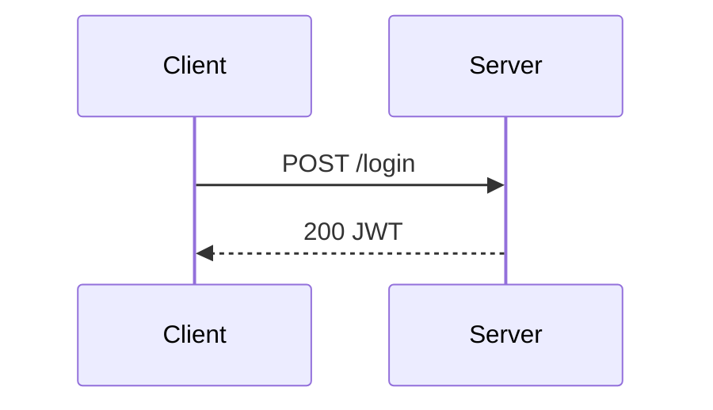

# /d2-convert

Input: "$ARGUMENTS"

## Task

Detect the Mermaid diagram type from the input, apply the appropriate translation rules, and produce valid D2 output using the matching specialist's syntax patterns.

---

## Step 1: Resolve Plugin Path

```bash
PLUGIN_DIR=$(find "$HOME/.claude/plugins/cache" -type d -name "d2" -path "*/skills/d2" 2>/dev/null | head -1)
```

Fallback (dev/repo):

```bash
PLUGIN_DIR=$(find "$HOME" -maxdepth 8 -type d -name "d2" -path "*/skills/d2" 2>/dev/null | head -1)
```

If still empty: stop — "Plugin not found. Is it installed?"

---

## Step 2: Check Dependencies

```bash
bash "$PLUGIN_DIR/scripts/ensure-deps.sh"
```

---

## Step 3: Read Config

Read `.claude/d2.json` if present. Apply:

- `theme_id` (default: 0)
- `layout` (default: "dagre")
- `sketch` (default: false)
- `output_directory` (default: "./diagrams")
- `auto_validate` (default: true)
- `auto_render` (default: false)

---

## Step 4: Get the Mermaid Input

If `$ARGUMENTS` is a file path ending in `.md` or `.mmd`: read that file and extract the first fenced code block (` ```mermaid `).

If `$ARGUMENTS` is a raw code block or inline text: use as-is.

If no input: ask the user to paste the Mermaid code.

---

## Step 5: Detect Mermaid Type

Read the first non-blank, non-comment line of the Mermaid code:

| First line starts with | Mermaid type | D2 specialist |
|---|---|---|
| `flowchart`, `graph` | Flowchart | d2-architecture |
| `sequenceDiagram` | Sequence | d2-sequence |
| `erDiagram` | Entity-Relationship | d2-er |
| `classDiagram` | Class | d2-class |
| `stateDiagram`, `stateDiagram-v2` | State | **Unsupported** |
| `gantt` | Gantt | **Unsupported** |
| `pie` | Pie | **Unsupported** |
| `journey` | User Journey | **Unsupported** |
| `gitgraph`, `gitGraph` | Git Graph | **Unsupported** |
| `mindmap` | Mind Map | **Unsupported** |
| `timeline` | Timeline | **Unsupported** |

**Unsupported:** Respond with:
> "D2 has no native equivalent for `{type}` diagrams. Supported conversions: flowchart, sequenceDiagram, erDiagram, classDiagram."

---

## Step 6: Apply Translation Rules

Apply the per-type rules below. Read the matching specialist file AFTER translating — it provides the canonical D2 syntax to validate your output against.

Specialist paths:

- Flowchart → `$PLUGIN_DIR/specialists/d2-architecture.md`
- Sequence → `$PLUGIN_DIR/specialists/d2-sequence.md`
- ER → `$PLUGIN_DIR/specialists/d2-er.md`
- Class → `$PLUGIN_DIR/specialists/d2-class.md`

---

### Flowchart / Graph

**Node shapes:**

| Mermaid | D2 |
|---|---|
| `A[Text]` | `A: Text` |
| `A(Rounded)` | `A: Rounded { shape: oval }` |
| `A{Decision}` | `A: Decision { shape: diamond }` |
| `A((Circle))` | `A: Circle { shape: circle }` |
| `A[(Database)]` | `A: Database { shape: cylinder }` |
| `A([Stadium])` | `A: Stadium { shape: oval }` |
| `A[/Parallelogram/]` | `A: Parallelogram` (no direct equivalent, use default) |

**Connections:**

| Mermaid | D2 |
|---|---|
| `A --> B` | `A -> B` |
| `A --> B: label` | `A -> B: label` |
| `A --- B` | `A -- B` |
| `A -.-> B` | `A -> B { style.stroke-dash: 4 }` |
| `A -.-> B: label` | `A -> B: label { style.stroke-dash: 4 }` |
| `A ==> B` | `A -> B { style.stroke-width: 4 }` |
| `A --o B` | `A -> B: o` (label the relationship type) |
| `A --x B` | `A -> B: x` |
| `A <--> B` | `A <-> B` |

**Subgraphs:**

```
# Mermaid
subgraph MyGroup
  A --> B
end

# D2
MyGroup: {
  A -> B
}
```

If a subgraph has a title different from its ID:

```
# Mermaid
subgraph sg1["My Title"]

# D2
sg1: My Title {
```

**Label quoting — REQUIRED:**
D2 interprets `{ }` in edge labels as edge map syntax. Any label containing `{`, `}`, `(`, `)`, `:`, `"`, or `;` MUST be wrapped in double quotes:

```d2
# WRONG — D2 parses {id, name} as an edge map key
A -> B: POST /users {id, name}

# CORRECT
A -> B: "POST /users {id, name}"
```

Apply this to every label during conversion. When in doubt, quote it.

**Styles:** Drop `style`, `classDef`, and `class` directives — translate visual intent using D2 shape or style properties only where semantically meaningful.

**Direction:**

- `graph TD` / `flowchart TD` → layout-engine: dagre (default, top-down)
- `graph LR` / `flowchart LR` → add `direction: right` inside each container, or use layout-engine: elk

---

### Sequence Diagram

All content wraps in a top-level `shape: sequence_diagram` container:

```d2
# Mermaid
sequenceDiagram
  participant A
  participant B
  A->>B: Hello
  B-->>A: Hi

# D2
shape: sequence_diagram
A -> B: Hello
B -> A: Hi { style.stroke-dash: 4 }
```

**Message translations:**

| Mermaid arrow | D2 |
|---|---|
| `A->>B: msg` | `A -> B: msg` |
| `A->B: msg` | `A -> B: msg` |
| `A-->>B: msg` | `A -> B: msg { style.stroke-dash: 4 }` |
| `A-xB: msg` | `A -> B: msg` (note: Mermaid "destroyed" semantic is lost) |
| `A-)B: msg` | `A -> B: msg` (async arrow, use plain) |

**Label quoting in sequences:**
Message labels containing `{`, `}`, `(`, `)`, `:`, or `;` MUST be double-quoted:

```d2
# WRONG
Client -> Server: POST /login {email, pass}

# CORRECT
Client -> Server: "POST /login {email, pass}"
```

**Participants:**

- Named `participant X as Label` → use `Label` as the node identifier in D2 (or alias map manually)
- `actor X` → same as participant in D2

**Activation bars:** No D2 equivalent. Drop `activate`/`deactivate` lines.

**Notes:**

```
# Mermaid
Note over A: Some note
Note over A,B: Shared note

# D2 — use dot-notation on the actor, NO arrow needed
A."Some note"
```

Notes spanning two actors can only be attached to one in D2 — attach to the more relevant actor.

**Alt / opt / loop blocks → D2 Groups:**

Mermaid's `alt/else/opt/loop` blocks map to D2 named groups. **Actors used inside groups must be pre-declared at the top level:**

```
# Mermaid
sequenceDiagram
  participant A
  participant B
  alt valid credentials
    A->>B: success
  else invalid
    A->>B: failure
  end

# D2
shape: sequence_diagram

# Pre-declare actors used in groups
A
B

valid credentials: {
  A -> B: success
}
invalid: {
  A -> B: failure
}
```

---

### ER Diagram

Each entity becomes a `sql_table` shape. Fields map from Mermaid `type name` to D2 `name: type`.

```d2
# Mermaid
erDiagram
  USER {
    int id PK
    string email UK
    string name
  }
  ORDER {
    int id PK
    int user_id FK
    decimal total
  }
  USER ||--o{ ORDER : "places"

# D2
USER: {
  shape: sql_table
  id: int { constraint: primary_key }
  email: string { constraint: unique }
  name: string
}
ORDER: {
  shape: sql_table
  id: int { constraint: primary_key }
  user_id: int { constraint: foreign_key }
  total: decimal
}
USER.id -> ORDER.user_id: places
```

**Constraint mapping:**

| Mermaid | D2 |
|---|---|
| `PK` | `{ constraint: primary_key }` |
| `FK` | `{ constraint: foreign_key }` |
| `UK` | `{ constraint: unique }` |
| `PK, FK` | `{ constraint: [primary_key; foreign_key] }` |
| (none) | (no constraint clause) |

**Relationship lines:** Map to `->` between the PK field of the parent and FK field of the child when identifiable. If fields are unclear, connect entity-to-entity with the relationship label:

```d2
USER -> ORDER: places
```

**Cardinality annotations** — D2 supports crow's foot notation natively via `source-arrowhead` and `target-arrowhead`. Map Mermaid cardinality to D2 arrowhead shapes:

| Mermaid | Meaning | D2 arrowhead |
|---|---|---|
| `\|o` | Zero or one | `cf-one` |
| `\|\|` | Exactly one | `cf-one-required` |
| `o{` | Zero or more | `cf-many` |
| `\|{` | One or more | `cf-many-required` |

```d2
# Mermaid: USER ||--o{ ORDER : "places"
# D2:
USER.id -> ORDER.user_id: places {
  source-arrowhead.shape: cf-one-required
  target-arrowhead.shape: cf-many
}
```

---

### Class Diagram

Each class becomes a labeled container. Methods and fields become labeled entries.

```d2
# Mermaid
classDiagram
  class Animal {
    +String name
    +speak() void
  }
  class Dog {
    +String breed
    +fetch() void
  }
  Animal <|-- Dog

# D2
Animal: {
  name: String
  speak(): void
}
Dog: {
  breed: String
  fetch(): void
}
Animal -> Dog: extends
```

**Relationship arrows:**

| Mermaid | D2 label |
|---|---|
| `A <|-- B` (inheritance) | `A -> B: extends` |
| `A *-- B` (composition) | `A -> B: composition` |
| `A o-- B` (aggregation) | `A -> B: aggregation` |
| `A --> B` (association) | `A -> B` |
| `A ..> B` (dependency) | `A -> B: uses { style.stroke-dash: 4 }` |
| `A ..|> B` (realization) | `A -> B: implements { style.stroke-dash: 4 }` |
| `A -- B` (link) | `A -- B` |

**Visibility modifiers:** Drop `+`, `-`, `#`, `~` prefixes — D2 has no visibility concept. Keep the name and type only.

**Stereotypes:** `<<interface>>`, `<<abstract>>`, `<<service>>` — append to the container label:

```d2
# Mermaid: class Flyable <<interface>>
# D2:
Flyable (interface): {
```

**Namespaces:** `namespace MyNS { class A }` → `MyNS: { A: { ... } }`

---

## Step 7: Build the vars Block

```d2
vars: {
  d2-config: {
    theme-id: {theme_id}
    layout-engine: {layout}
    sketch: {sketch}
  }
}
```

Place this at the TOP of the output file (before all diagram content).

**Exception:** ER diagrams — force `sketch: false` regardless of config (sketch mode breaks `sql_table` shapes).

---

## Step 8: Validate

```bash
d2 validate {output_file}
```

If validation fails, inspect the error and apply the fix from `$PLUGIN_DIR/references/guides/troubleshooting.md`. Fix silently and re-validate before reporting to the user.

---

## Step 9: Save Output

Output filename: `{original-name}-d2-{YYYYMMDD}.d2`

If the input was inline text (no filename): `converted-{mermaid-type}-{YYYYMMDD}.d2`

Save to `OUTPUT_DIR`.

---

## Step 10: Render (if enabled)

If `auto_render == true`:

```bash
d2 {output_file} {output_file_without_ext}.svg
```

---

## Step 11: Report

```
Converted {mermaid-type} diagram to D2.

  Input:  {source}
  Output: {output_file}
  Render: {svg_path or "not rendered (auto_render=false)"}

Translation notes:
  - {any semantic losses or approximations made}
```

Always list translation notes — things that could not be converted exactly (activation bars, cardinality notation, style directives, unsupported constructs).

---

## Example

**Input:**



**Output:**

```d2
vars: {
  d2-config: {
    theme-id: 0
    layout-engine: dagre
    sketch: false
  }
}

shape: sequence_diagram
Client -> Server: POST /login
Server -> Client: 200 JWT { style.stroke-dash: 4 }
```

**Translation notes:**

- `participant X as Label` aliases resolved: `C` → `Client`, `S` → `Server`
- `-->>` (dashed reply arrow) mapped to `{ style.stroke-dash: 4 }`
